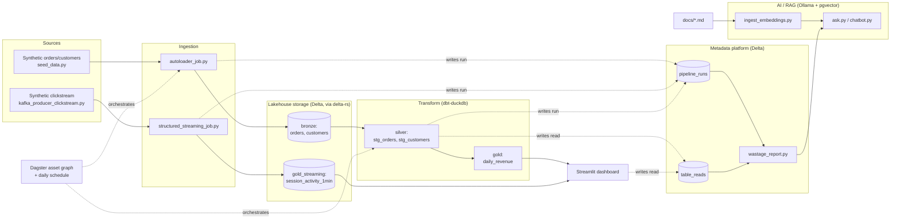

# Architecture

This is the architecture as actually built and demoed: a local-first
Python stack (no Spark, no cloud account) with every component chosen so
that swapping it for its cloud/production equivalent touches one narrow
seam, documented in full in `docs/interfaces.md`. The diagram below is the
real local-dev system, not an aspirational cloud sketch -- everything in
it runs end to end via the scripts named on each node.

## Layer notes (local-dev default -- see `docs/interfaces.md` for the cloud swap on every one of these)

**Sources.** Two synthetic batch sources (orders, customers) plus one
synthetic streaming source (clickstream events). Deliberately minimal --
the point of the project is depth in the metadata/AI layer, not breadth of
connectors.

**Ingestion.** Config-driven: `ingestion/batch/sources.yaml` describes each
batch source declaratively, so adding one is a config change, not new
code. Streaming reads a real Kafka-wire-protocol broker (Redpanda, via
`docker-compose.yml`) -- not a mock.

**Lakehouse storage.** `deltalake` (delta-rs, Rust-native, no JVM) writes
real local Delta tables for bronze and the streaming gold table, giving
genuine time-travel/version history without Spark. Silver and gold
(batch) are built by dbt into a DuckDB warehouse file, which reads bronze
straight off Delta via DuckDB's native `delta_scan()`.

**Transform.** `dbt-duckdb` -- the existing dbt SQL (staging + marts
models) needed zero changes to run against DuckDB instead of Databricks
SQL. `transform/run_dbt.py` wraps `dbt-core`'s programmatic `dbtRunner`
API so every invocation reports into the metadata platform, and parses
dbt's own `manifest.json` afterward to log each model's real dependencies
into `table_reads` -- the same source real OpenLineage-dbt integrations
use.

**Orchestration.** Dagster models bronze -> silver -> gold as an asset
graph with a daily schedule. Locally, each asset body calls the same
Python functions the manual walkthrough uses
(`autoloader_job.run_source()`, `run_dbt.run_dbt_job()`); the cloud swap
is a Databricks Jobs API call in those same four function bodies, nothing
else.

**Serving.** A Streamlit app reads both the batch gold table (DuckDB) and
the streaming gold table (Delta) directly, through separate short-lived
connections so it never holds a lock a concurrent batch write needs.

**AI/RAG.** Ollama (`nomic-embed-text` for embeddings, `llama3.2:3b` for
answers) via its OpenAI-compatible API -- no API key, no cloud spend, and
no new Python dependency (`openai` client, just pointed at localhost).
pgvector (Postgres, via `docker-compose.yml`) is the vector store, behind
a `VectorStore` ABC so a real embedding/LLM API or Databricks Vector
Search is a one-class swap.

**Metadata platform.** The differentiator, and the one layer that's
identical in spirit whether local or cloud. Every job -- batch, streaming,
dbt, Dagster asset -- writes one row per run into `pipeline_runs` via a
shared emitter (`metadata/openlineage_emitter.py`). `table_reads` is a
second, append-only log (dbt's manifest.json + Streamlit view events
locally; Databricks' `system.query.history` in the cloud) that lets the
wastage models (`metadata/wastage_models/`) tell genuinely-unused tables
apart from ones only ever read by another pipeline internally.

**Ops chatbot.** RAG over `pipeline_runs` (via deterministic SQL tools --
reusing the exact same wastage-model queries, not vector search, for
numeric questions) plus vector search over `docs/*.md` for open-ended "why
did X happen" questions. A known tradeoff of the 3B local model: it's
inconsistent about fully summarizing a multi-row SQL result in prose, so
the raw data is always printed alongside the answer rather than trusted
alone.

See `docs/build-plan.md` for the phased build order (each phase's
"Local-first path" note explains the specific local substitute chosen and
why) and `docs/interfaces.md` for the full replaceability contract, one
row per swap point.
